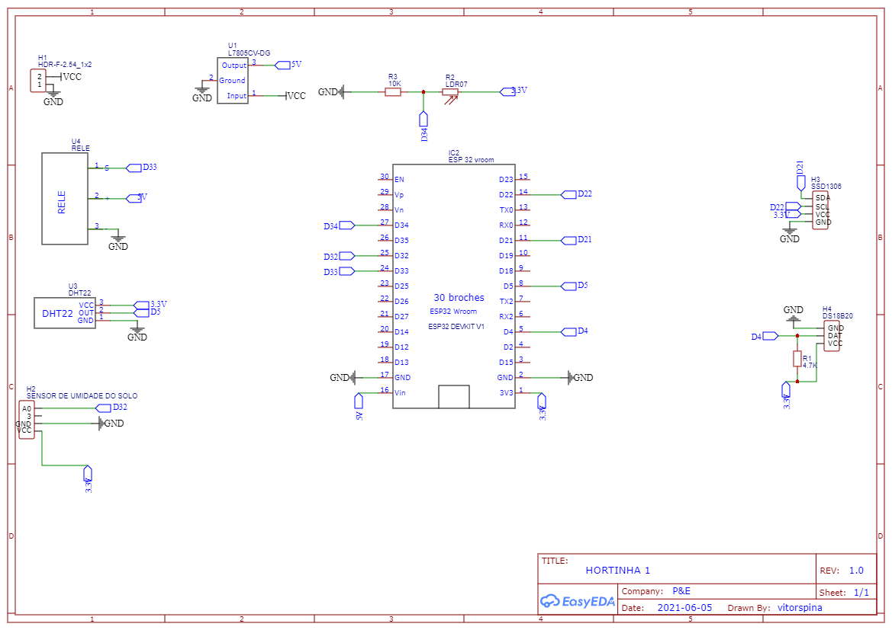
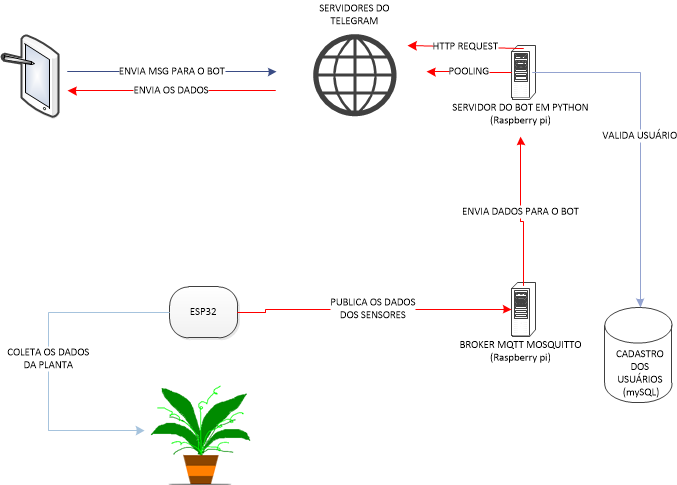

# Horta_IOT
Este projeto consiste em uma horta controlada por um ESP 32 em conjunto com alguns sensores, uma bomba de aquário e um display OLED responsável por criar um dashboard com os dados sobre a horta. Juntamente com o ESP 32 foi utilizado um bot no telegram escrito em python 3. A conexão entre o bot e o ESP32 foi utilizando um Broker Mosquitto. A fim de se manter o controle de acesso as informações da horta, foi criado um banco de dados mySQL com os ids da conversas entre o bot e os responsáveis pela horta. Os sensores utilizados foram:
* Sensor de temperatura DS18b20;
* Sensor de Umidade e temperatura DHT 11;
* Um módulo relé para controlar a bomba;
* LDR para medir a intesidade do sol;
* Um módulo de umidade do solo LM393;
* Display OLED SSD1306 128x64;

O esquematico está disposto abaixo e o firmware se encontra na pasta ESP com o nome firmware_final.ino.



A arquitetura do projeto segue a imagem abaixo. O projeto se encontra na versão 1.X. O Broker, o mySQL e o Bot rodam em um raspberry pi zero W com 512mb de RAM. Melhorias ainda podem ser implementadas como a utilização de um Watchdog devido a eventuais travamentos no sistema.



As bibliotecas utilizadas encontram-se no arquivo requirements.txt para facilitar a instalação. Faça o seguinte comando no seu terminal.

```bash
pip install -r requirements.txt
```
Conforme presente na licença, sinta-se livre para usar e modificar o projeto como desejar. Caso queira discuti-lo, entre em contato comigo pelo meu linkedin presente no README.md do meu perfil.

Boa jardinagem papais e mamães de plantas!!!!